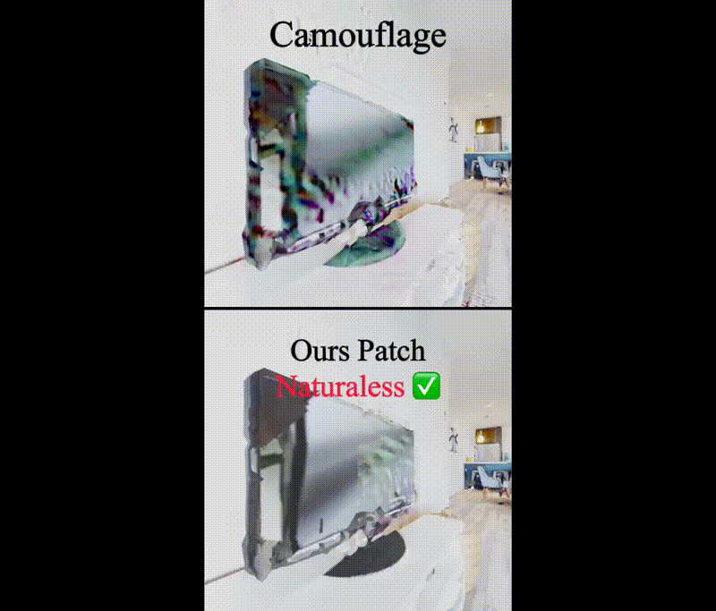
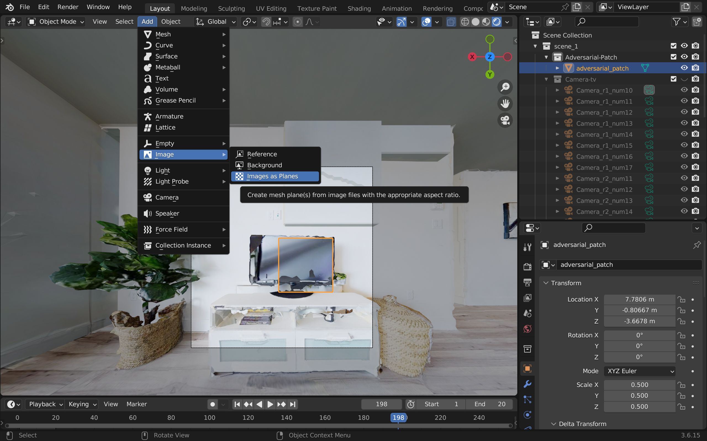
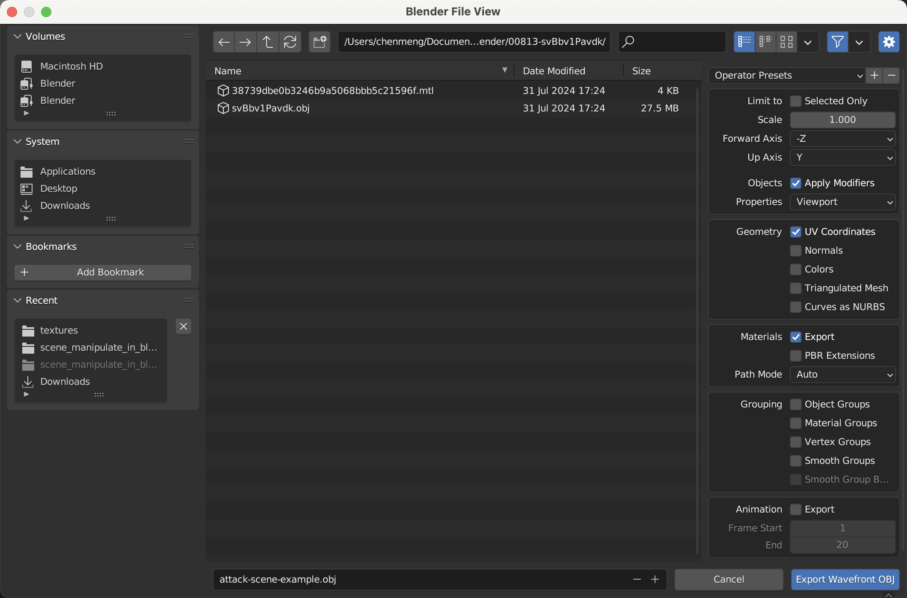
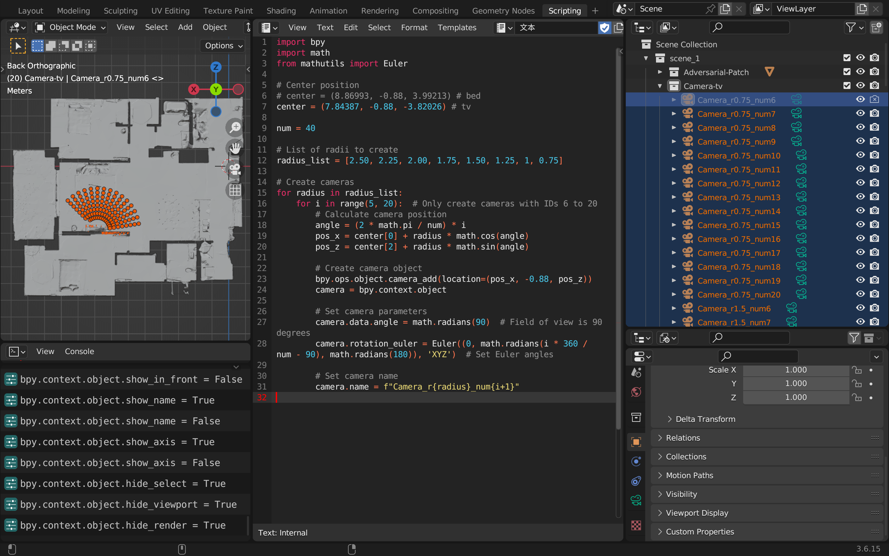

# Towards Physically-Realizable Adversarial Attacks in Embodied Vision Navigation

[arXiv Paper](https://arxiv.org/abs/2409.10071) 

## Abstract
The deployment of embodied navigation agents in safety-critical environments raises concerns about their vulnerability to adversarial attacks on deep neural networks. However, current attack methods often lack practicality due to challenges in transitioning from the digital to the physical world, while existing physical attacks for object detection fail to achieve both multi-view effectiveness and naturalness. To address this, we propose a practical attack method for embodied navigation by attaching adversarial patches with learnable textures and opacity to objects. Specifically, to ensure effectiveness across varying viewpoints, we employ a multi-view optimization strategy based on object-aware sampling, which uses feedback from the navigation model to optimize the patch's texture. To make the patch inconspicuous to human observers, we introduce a two-stage opacity optimization mechanism, where opacity is refined after texture optimization. Experimental results show our adversarial patches reduce navigation success rates by about 40%, outperforming previous methods in practicality, effectiveness, and naturalness.

## Example Video



## Data Preparation 
Download the attack scenarios and model weights and place them in the corresponding directories: [https://drive.google.com/file/d/1dhUcv7MvavmHwG4E11L12KK6zkjP1Ui5/view?usp=drive_link](https://drive.google.com/file/d/1dhUcv7MvavmHwG4E11L12KK6zkjP1Ui5/view?usp=drive_link)

## Setting up the Environment for Testing Navigation Agents
Refer to [PEANUT](https://github.com/ajzhai/PEANUT) for environment setup
```python
# Download navigation dataset and model weights, place them in the corresponding directories
Physical-Attacks-in-Embodied-Navigation
├── PEANUT/
│   ├── habitat-challenge-data/
│   │   ├── objectgoal_hm3d/
│   │   │   ├── train/
│   │   │   ├── val/
│   │   │   └── val_mini/
│   │   └── data/
│   │       └── scene_datasets/
│   │           └── hm3d/
│   │               ├── train/
│   │               └── val/
│   └── test_patch/
│       └── models/
│           ├── pred_model_wts.pth
│           └── mask_rcnn_R_101_cat9.pth

# Build Docker (requires sudo)
cd PEANUT
./build_and_run.sh

# After building, enter docker to test navigation agents
conda activate habitat
export CUDA_VISIBLE_DEVICES=0
./nav_exp.sh

# If you need to save the current running Docker container as an image
docker commit <container ID or container name> <image name>
```

## Setting up the Environment for Optimizing Adversarial Patches
Refer to [REVAMP](https://github.com/poloclub/revamp) for environment setup
```python
# Set up conda environment
conda env create -f environment.yml 

# torch and cuda versions
pip install torch==1.10.0+cu111 torchvision==0.11.0+cu111 torchaudio==0.10.0 -f https://download.pytorch.org/whl/torch_stable.html  

# Install pre-built Detectron2 (https://detectron2.readthedocs.io/en/latest/tutorials/install.html): 
python -m pip install detectron2==0.6 -f https://dl.fbaipublicfiles.com/detectron2/wheels/cu111/torch1.10/index.html 
```

Set up the victim model
  - Victim model configuration directory: ```configs/model/mask_rcnn_R_101_cat9.yaml```
  - Victim model's configuration and weights directory: ```pretrained-models/mask_rcnn_R_101_cat9```

Set up the attack scenario
- Download example scenes in obj and xml formats and place them in the corresponding locations.
- Use the ```test-patch/test_generate_random.py``` script to generate an initial RGB texture and an initial transparency mask, install the Blender (3.6.0 version) plugin: import images as planes, import the initial adversarial patch (the image after merging the initial RGB texture and the initial transparency mask), and adjust the position: 
- Convert the obj format scene to xml format. First, install the plugin [Mitsuba-Blender](https://github.com/mitsuba-renderer/mitsuba-blender), follow the Mitsuba-Blender Installation tutorial to install. After installation, File -> Export -> Mitsuba(.xml) -> choose "Selection Only" and export.
- Place the xml exported from blender into scenes/00813-svBbv1Pavdk/00813-svBbv1Pavdk.xml, and the corresponding ply and png files also need to be placed in the relative directories meshes and textures.

## Generate adversarial patch
- Set the id for untargeted attack in the global configuration ```configs/config.yaml```, for example, TV, untarget_idx: 5

- Set the parameters to be optimized in the scene configuration, taking the scene config configs/scene/00813-svBbv1Pavdk.yaml as an example,
  - If you want to optimize camouflage, target_param_keys: ["adversarial_patch.bsdf.nested_bsdf.reflectance.data"]
  - If you want to optimize the opacity of the adversarial patch, target_param_keys: ["adversarial_patch.bsdf.opacity.data"]
  - If you want to optimize the texture of the adversarial patch, target_param_keys: ["elm__50.bsdf.reflectance.data"]

- Run the optimization script. If the memory is not enough, in configs/config.yaml, reduce samples_per_pixel, increase multi_pass_spp_divisor
```
export CUDA_VISIBLE_DEVICES=0
python revamp.py
```

## Test the attack effect of the adversarial patch on the navigation agent
- After optimization, export the attack scene's obj: 
- Convert the scene from obj format to glb format, ignore the obj file, the material format of the adversarial patch in the mtl file is as follows (d is opacity, map_Kd is texture, map_d is the transparency mask)
```python
newmtl random_gaussian_noise
d 0.20000
illum 1
map_Kd adversarial_patch.png
map_d adversarial_patch_mask.png
```

```python
# Install obj2gltf
conda install -c conda-forge nodejs
npm install -g obj2gltf
conda activate obj
# Use obj2gltf to convert
obj2gltf -i attack-scene-example.obj -o svBbv1Pavdk.basis.glb
```

- Copy to the navigation scene dataset directory, replace the original glb, for example:
```
cp -f svBbv1Pavdk.basis.glb /home/disk1/cm/Projects/PEANUT/habitat-challenge-data/data/scene_datasets/hm3d/val/00813-svBbv1Pavdk/
```

- In the PEANUT docker environment, run the navigation agent to test the attack effect (you can filter the task dataset to only include the target episode for testing)

## Object-aware Sampling
Use the blender script to generate camera positions, export xml, use test-patch/test_delete.py, delete id and name

Script content:
```python
import bpy
import math
from mathutils import Euler

# Center position
# center = (8.86993, -0.88, 3.99213) # bed
center = (7.84387, -0.88, -3.82026) # tv

num = 40

# List of radii to create
radius_list = [2.50, 2.25, 2.00, 1.75, 1.50, 1.25, 1, 0.75]

# Create cameras
for radius in radius_list:
    for i in range(5, 20):  # Only create cameras with IDs 6 to 20
        # Calculate camera position
        angle = (2 * math.pi / num) * i
        pos_x = center[0] + radius * math.cos(angle)
        pos_z = center[2] + radius * math.sin(angle)
        
        # Create camera object
        bpy.ops.object.camera_add(location=(pos_x, -0.88, pos_z))
        camera = bpy.context.object
        
        # Set camera parameters
        camera.data.angle = math.radians(90)  # Field of view is 90 degrees
        camera.rotation_euler = Euler((0, math.radians(i * 360 / num - 90), math.radians(180)), 'XYZ')  # Set Euler angles
        
        # Set camera name
        camera.name = f"Camera_r{radius}_num{i+1}"
```

## Citation
Please cite our paper if you find this repo useful!
```bibtex
@article{chen2024towards,
  title={Towards Physically-Realizable Adversarial Attacks in Embodied Vision Navigation},
  author={Chen, Meng and Tu, Jiawei and Qi, Chao and Dang, Yonghao and Zhou, Feng and Wei, Wei and Yin, Jianqin},
  journal={arXiv preprint arXiv:2409.10071},
  year={2024}
}
```

## Acknowledgments
This project builds upon code from [REVAMP](https://github.com/poloclub/revamp),  [PEANUT](https://github.com/ajzhai/PEANUT).  We thank the authors of these projects for their amazing work!